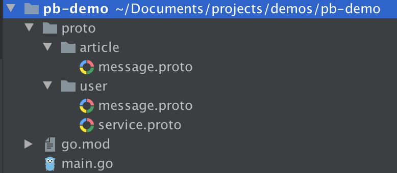

[https://segmentfault.com/a/1190000021456180?utm_campaign=studygolang.com&utm_medium=studygolang.com&utm_source=studygolang.com][引用]
#### Protobuf 的 import 功能在 Go 项目中的实践

业务场景
我们会有这样的需求：在不同的文件夹中定义了不同的 proto 文件，这些不同的文件夹可能是一些不同的 gRPC 服务。因为不想重复定义某一个 message，所以其中一个服务可能会用到其他服务中定义的 message，那么这个时候就需要使用到 proto 文件的 import 功能。

接下来说说我在 Go 项目中使用 protobuf 的 import 时所遇到的坑。

案例
首先，我们来创建一个实验项目作为案例，便以说明，结构如下：


文件 go.mod 中声明了该项目模块名 module github.com/xvrzhao/pb-demo，proto 文件夹中含有两个 gRPC 服务，分别为 article 和 user，我们在这两个文件夹中定义各自所需要的 messages 和 services。

一般情况下，我们会将编译生成的 pb.go 文件生成在与 proto 文件相同的目录，这样我们就不需要再创建相同的目录层级结构来存放 pb.go 文件了。由于同一文件夹下的 pb.go 文件同属于一个 package，所以在定义 proto 文件的时候，相同文件夹下的 proto 文件也应声明为同一的 package，并且和文件夹同名，这是因为生成的 pb.go 文件的 package 是取自 proto package 的。

同属于一个包内的 proto 文件之间的引用也需要声明 import ，因为每个 proto 文件都是相互独立的，这点不像 Go（包内所有定义均可见）。我们的项目 user 模块下 service.proto 就需要用到 message.proto 中的 message 定义，代码是这样写的：

user/service.proto:

```syntax = "proto3";  
package user;  // 声明所在包
option go_package = "github.com/xvrzhao/pb-demo/proto/user";  // 声明生成的 go 文件所属的包
  
import "proto/user/message.proto";  // 导入同包内的其他 proto 文件
import "proto/article/message.proto";  // 导入其他包的 proto 文件
  
service User {  
    rpc GetUserInfo (UserID) returns (UserInfo);  
    rpc GetUserFavArticle (UserID) returns (article.Articles.Article);  
}
```

user/message.proto:

```
syntax = "proto3";  
package user;  
option go_package = "github.com/xvrzhao/pb-demo/proto/user";  
  
message UserID {  
    int64 ID = 1;  
}  
  
message UserInfo {  
    int64 ID = 1;  
    string Name = 2;  
    int32 Age = 3;  
    gender Gender = 4;  
    enum gender {  
        MALE = 0;  
        FEMALE = 1;  
    }  
}
```

可以看到，我们在每个 proto 文件中都声明了 package 和 option go_package，这两个声明都是包声明，到底两者有什么关系，这也是我开始比较迷惑的。

我是这样理解的，package 属于 proto 文件自身的范围定义，与生成的 go 代码无关，它不知道 go 代码的存在（但 go 代码的 package 名往往会取自它）。这个 proto 的 package 的存在是为了避免当导入其他 proto 文件时导致的文件内的命名冲突。所以，当导入非本包的 message 时，需要加 package 前缀，如 service.proto 文件中引用的 Article.Articles，点号选择符前为 package，后为 message。同包内的引用不需要加包名前缀。

article/message.proto:


```
syntax = "proto3";  
package article;  
option go_package = "github.com/xvrzhao/pb-demo/proto/article";  
  
message Articles {  
    repeated Article Articles = 1;  
    message Article {  
        int64 ID = 1;  
        string Title = 2;  
    }  
}
```
而 option go_package 的声明就和生成的 go 代码相关了，它定义了生成的 go 文件所属包的完整包名，所谓完整，是指相对于该项目的完整的包路径，应以项目的 Module Name 为前缀。如果不声明这一项会怎么样？最开始我是没有加这项声明的，后来发现 依赖这个文件的 其他包的 proto 文件 所生成的 go 代码 中（注意断句，已用斜体和正体标示），引入本文件所生成的 go 包时，import 的路径并不是基于项目 Module 的完整路径，而是在执行 protoc 命令时相对于 --proto_path 的包路径，这在 go build 时是找不到要导入的包的。这里听起来可能有点绕，建议大家亲自尝试一下。

protoc 命令
另外，我们说说编译 proto 文件时的命令参数。

首先 protoc 编译生成 go 代码所用的插件 protoc-gen-go 是不支持多包同时编译的，执行一次命令只能同时编译一个包，关于该讨论可以查看该项目的 issue#39。

接下来讲讲我遇到的另外一个坑。通常情况下我们编译命令是这样的（基于本项目来说，执行命令的 pwd 为项目根目录）：

`$ protoc --proto_path=. --go_out=. ./proto/user/*.proto # 编译 user 路径下所有 proto 文件
`其中，--proto_path 或者 -I 参数用以指定所编译源码（包括直接编译的和被导入的 proto 文件）的搜索路径，proto 文件中使用 import 关键字导入的路径一定是要基于 --proto_path 参数所指定的路径的。该参数如果不指定，默认为 pwd ，也可以指定多个以包含所有所需文件。

其中，--go_out 参数是用来指定 protoc-gen-go 插件的工作方式 和 go 代码目录架构的生成位置，可以向 --go_out 传递很多参数，见 golang/protobuf 文档 。主要的两个参数为 plugins 和 paths ，代表 生成 go 代码所使用的插件 和 生成的 go 代码的目录怎样架构。--go_out 参数的写法是，参数之间用逗号隔开，最后加上冒号来指定代码目录架构的生成位置，例如：--go_out=plugins=grpc,paths=import:. 。paths 参数有两个选项，import 和 source_relative 。默认为 import ，代表按照生成的 go 代码的包的全路径去创建目录层级，source_relative 代表按照 proto 源文件的目录层级去创建 go 代码的目录层级，如果目录已存在则不用创建。

在上面的示例命令中，--go_out 默认使用了 paths=import 所以，我的 go 文件都被编译到了 ./github.com/xvrzhao/pb-demo/proto/user/ 下，后来阅读 文档 才发现:

However, the output directory is selected in one of two ways. Let us say we have inputs/x.proto with a go_package option of github.com/golang/protobuf/p . The corresponding output file may be:

Relative to the import path:
$ protoc --go_out=. inputs/x.proto
# writes ./github.com/golang/protobuf/p/x.pb.go
( This can work well with --go_out=$GOPATH )

Relative to the input file:
$ protoc --go_out=paths=source_relative:. inputs/x.proto
# generate ./inputs/x.pb.go
所以，我们应该将 --go_out 参数改为 --go_out=paths=source_relative:. 。

请切记 option go_package 声明和 --go_out=paths=source_relative:. 命令行参数缺一不可 。

option go_package 声明 是为了让生成的其他 go 包（依赖方）可以正确 import 到本包（被依赖方）
--go_out=paths=source_relative:. 参数 是为了让加了 option go_package 声明的 proto 文件可以将 go 代码编译到与其同目录。
一般用法
为了统一性，我会将所有 proto 文件中的 import 路径写为相对于项目根目录的路径，然后 protoc 的执行总是在项目根目录下进行：

$ protoc --go_out=plugins=grpc,paths=source_relative:. ./proto/user/*.proto 
$ protoc --go_out=plugins=grpc,paths=source_relative:. ./proto/article/*.proto
如果你觉得每个包都需要单独编译，有些麻烦，可以执行脚本（ **/* 代表递归获取当前目录下所有的文件和文件夹）：

pb-demo 下执行：

$ for x in **/*.proto; do protoc --go_out=plugins=grpc,paths=source_relative:. $x; done
循环依赖
注意，不同包之间的 proto 文件不可以循环依赖，这会导致生成的 go 包之间也存在循环依赖，导致 go 代码编译不通过。

总结
感觉 protobuf 的使用非常繁杂，文档散落在各处（ protobuf 官方文档 / golang protobuf 文档 / grpc 文档 ），要注意的细节也很多，需要多加实践，多加总结。

[引用]: https://segmentfault.com/a/1190000021456180?utm_campaign=studygolang.com&utm_medium=studygolang.com&utm_source=studygolang.com